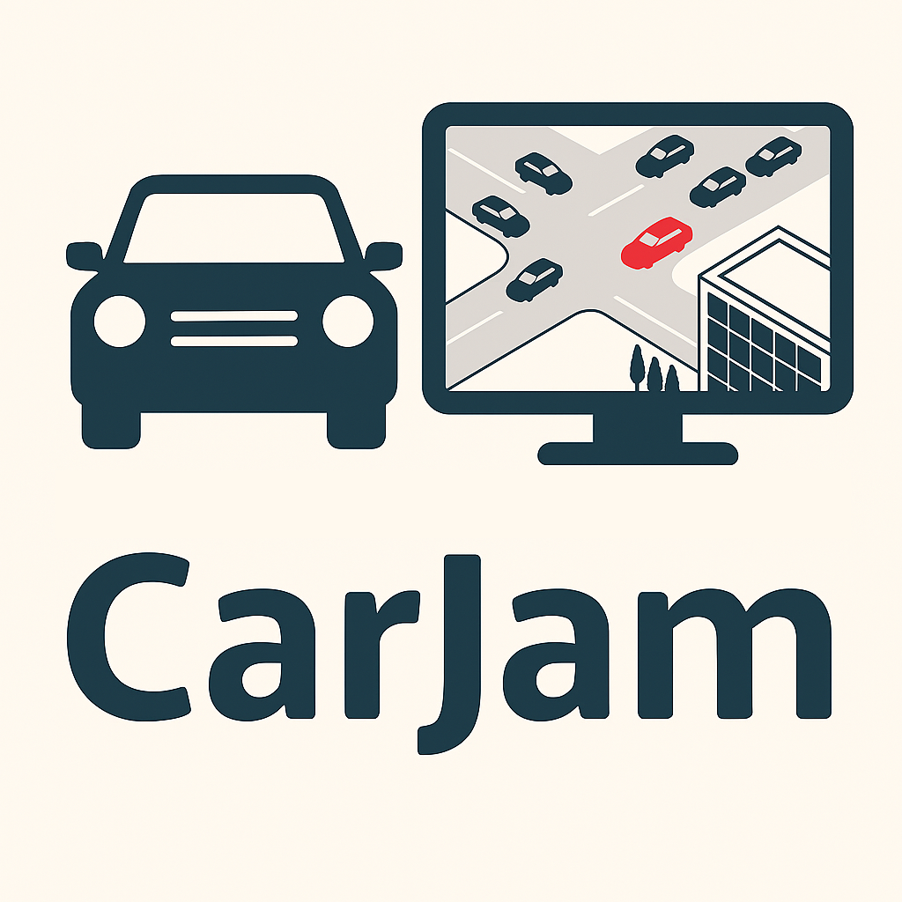

# 🚗 CarJam: Vehicle Tracking & Counting with YOLOv8 + Supervision

**CarJam** is a pet project that detects, tracks, and counts vehicles in video streams using **YOLOv8** and the **Supervision** toolkit. It runs in **Google Colab**, making it easy to experiment, prototype, and explore traffic analysis with minimal setup.

---

## 📌 Features

- **Vehicle detection** with Ultralytics YOLOv8
- **Object tracking** using Supervision's built-in utilities
- **Custom class filtering**, e.g., cars, trucks, buses
- **Virtual line counting**, including support for diagonal lines
- **Visual annotations** on frames (boxes, labels, counters)
- **Google Drive integration** for loading videos and models

---

## 📓 Main Notebook

The core logic is implemented in the following notebook:

[`fork-how-to-track-and-count-vehicles-with-yolov8-and-supervison.ipynb`](https://github.com/rko4/carjam/blob/main/fork-how-to-track-and-count-vehicles-with-yolov8-and-supervison.ipynb)

Basically, it is a fork of [Supervision notebook](https://github.com/roboflow/notebooks/blob/main/notebooks/how-to-track-and-count-vehicles-with-yolov8-and-supervison.ipynb).

It demonstrates:
- Loading a YOLOv8 model
- Detecting specific object classes
- Annotating frames with bounding boxes and labels
- Counting objects as they cross a virtual line

---

## 📁 Input & Output

- **Input:** Any video file (e.g., `.mp4`) from Google Drive
- **Output:** Annotated video frames with visual counting and tracking

---

## 🔮 Future Ideas

- 🅿️ Parking space availability tracking  
- 🧍 Pedestrian zone analytics  
- 🛰️ Process videostream from a remote webcam

---

## 🧠 Background

The project started as an experiment to learn video-based detection and tracking.

The name *CarJam* reflects the real-world use case of understanding traffic density and vehicle movement patterns.

Though not intended as a commercial tool, it may serve as a stepping stone toward more advanced traffic analysis applications.

---

## 🪪 License

This project is released under the MIT License. See [LICENSE](LICENSE) for details.

---

## 🤝 Contributions

Pull requests, suggestions, and forks are welcome.  
If you adapt it for something cool — feel free to share!

---
